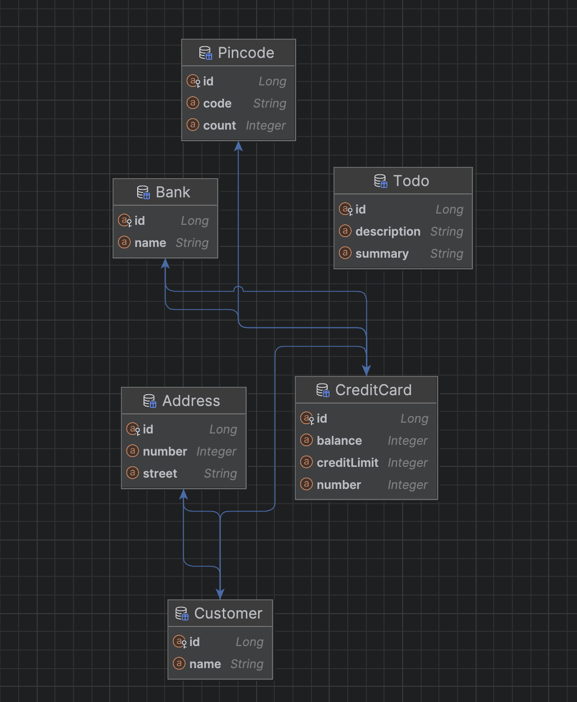

## Link to repo
https://github.com/Erik-G-I/dat250-jpa-tutorial

## How i inspected the database
With Intellij i could generate a diagram of the classes, so i could see that it matched the structure of the task.

## Issues during
I struggled for some time with getting the tests to pass as i was getting errors when compairing 
a collection object. This was because i had mixed Collections and HashSet declarations. Changing all uses of "Collection" with "Set" fixed it.

